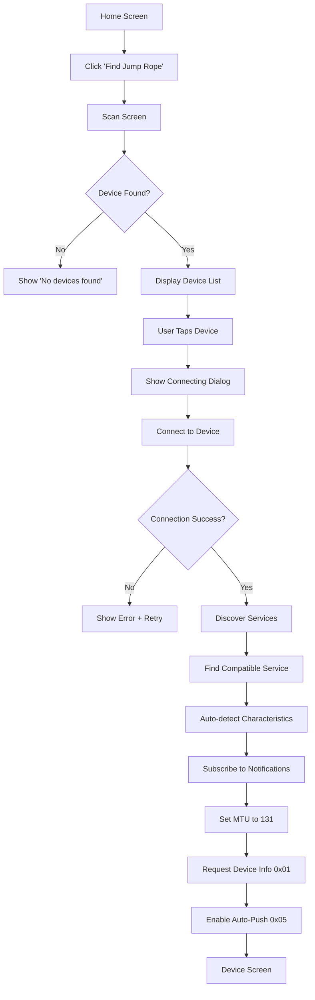
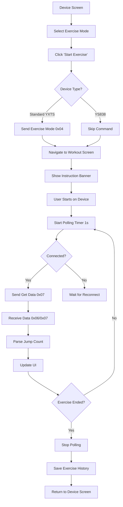

# Jumpeezzz - Smart Jump Rope Flutter App

A Flutter application for tracking jump rope exercises with real-time BLE connectivity to YXTS smart jump rope devices.

## 🎯 Features

- **Real-time Jump Tracking** - Live jump count updates during exercise
- **BLE Connectivity** - Seamless Bluetooth connection to smart jump ropes
- **Multiple Exercise Modes** - Free Jump, Countdown Timer, Count Mode
- **Exercise History** - Track and review past workouts
- **Device Management** - Connect, configure, and monitor jump rope devices
- **Auto-push & Polling** - Dual data reception strategy for reliable tracking

## 📱 Supported Devices

The app supports YXTS protocol-compatible smart jump ropes:
- **TY** series
- **ROGUE** series
- **YS137** series
- **YX** series
- **YS838** series (with auto-detected UUIDs)

## 🏗️ Architecture

### App Structure

```
jumpeezzz/
├── lib/
│   ├── main.dart                 # App entry point
│   ├── constants/
│   │   └── ble_constants.dart    # BLE UUIDs and command constants
│   ├── models/
│   │   ├── device_info.dart      # Device information model
│   │   └── exercise_data.dart    # Exercise data model
│   ├── services/
│   │   └── ble_service.dart      # BLE communication service
│   ├── controllers/
│   │   └── ble_controller.dart   # GetX state management
│   ├── screens/
│   │   ├── home_screen.dart      # Main landing screen
│   │   ├── scan_screen.dart      # Device scanning
│   │   ├── device_screen.dart    # Device control panel
│   │   └── workout_screen.dart   # Real-time workout tracking
│   ├── widgets/
│   │   ├── device_tile.dart      # Device list item
│   │   ├── gradient_button.dart  # Styled button component
│   │   └── stat_card.dart        # Statistics display card
│   ├── utils/
│   │   └── byte_utils.dart       # Byte conversion utilities
│   └── theme/
│       └── app_theme.dart        # App-wide theming
```

### State Management

The app uses **GetX** for reactive state management:
- `BleController` - Manages BLE connection state, device data, and exercise tracking
- Reactive observables for real-time UI updates
- Automatic cleanup and resource management

## 🔌 BLE Protocol Specification

### Standard YXTS UUIDs

```dart
Service UUID:        00001910-0000-1000-8000-00805f9b34fb
Write Characteristic: 00002b11-0000-1000-8000-00805f9b34fb
Notify Characteristic: 00002b10-0000-1000-8000-00805f9b34fb
```

### YS838 Device UUIDs (Auto-detected)

```dart
Service UUID:        000000ff-0000-1000-8000-00805f9b34fb
Write Characteristic: 0000ff02-0000-1000-8000-00805f9b34fb
Notify Characteristic: 0000ff01-0000-1000-8000-00805f9b34fb
```

### Command Structure

All commands follow this format:
```
[Length1] [Length2] [Command] [Data...]
```

### SDK Commands

#### 1. Get Device Info (0x01)
```dart
Command: [0x01, 0x01, 0x01]
Response: 40 bytes containing:
  - Serial Number (null-terminated string)
  - Software Version (null-terminated string)
  - BLE Version (null-terminated string)
  - MAC Address (6 bytes)
```

#### 2. Set Time & Weight (0x02)
```dart
Command: [0x01, 0x07, 0x02, UTC_Time(4), Weight(2)]
UTC_Time: 4 bytes, big-endian, seconds since epoch
Weight: 2 bytes, big-endian, in kg
```

#### 3. Get Device State (0x03)
```dart
Command: [0x01, 0x01, 0x03]
Response: Contains battery level and device state
  - Battery: 0-100%
  - State: 0x00=Idle, 0x01=Exercising, 0x02=Paused, etc.
```

#### 4. Set Exercise Mode (0x04)
```dart
Command: [0x01, 0x07, 0x04, State, Mode, Target(4)]
State: 0=Standby, 1=Start, 2=End
Mode: 0=Free Jump, 1=Countdown, 2=Count
Target: 4 bytes, big-endian (seconds or jump count)

⚠️ Note: YS838 devices disconnect when receiving this command.
         Use manual start on device instead.
```

#### 5. Set Auto-Push (0x05)
```dart
Command: [0x01, 0x02, 0x05, Enable]
Enable: 0x00=Disable, 0x01=Enable
Response: [0x01, 0x02, 0x05, Status]
```

#### 6. Real-time Data (0x06)
```dart
Auto-pushed by device when enabled
Data: 31 bytes exercise data (same format as 0x07)
```

#### 7. Get Exercise Data (0x07)
```dart
Command: [0x01, 0x01, 0x07]
Response: 31 bytes containing:
  Byte 0-1:   Length (0x01, 0x1D)
  Byte 2:     Command (0x07)
  Byte 3:     State (0x00=Exercising, 0x01=Paused, 0x03=Idle)
  Byte 4-7:   Start Time (UTC, 4 bytes, big-endian)
  Byte 8-9:   Duration (seconds, 2 bytes, big-endian)
  Byte 10-13: Jump Count (4 bytes, big-endian) ⭐
  Byte 14-15: Interruption Count (2 bytes, big-endian)
  Byte 16-17: Trip Count (2 bytes, big-endian)
  Byte 18-21: Calories (4 bytes, big-endian)
  Byte 22-25: Max Frequency (4 bytes, big-endian)
  Byte 26-29: Average Frequency (4 bytes, big-endian)
  Byte 30:    Reserved
```

### Data Parsing Example

```dart
// Extract jump count from bytes 10-13
final jumpCount = ByteUtils.bytesToInt(data.sublist(10, 14));

// ByteUtils.bytesToInt implementation (big-endian)
static int bytesToInt(List<int> bytes) {
  int value = 0;
  for (int i = 0; i < bytes.length; i++) {
    value += (bytes[i] & 0xFF) << ((bytes.length - 1 - i) * 8);
  }
  return value;
}
```

## 📊 Application Flow

### Connection Flow



### Exercise Flow



### Data Reception Strategy


## 🚀 Getting Started

### Prerequisites

```bash
Flutter SDK: >=3.0.0
Dart SDK: >=3.0.0
```

### Dependencies

```yaml
dependencies:
  flutter:
    sdk: flutter
  get: ^4.6.6                    # State management
  flutter_blue_plus: ^1.32.12    # BLE communication
  shared_preferences: ^2.2.3     # Local storage
```

### Installation

```bash
# Clone the repository
git clone <repository-url>
cd jumpeezzz

# Install dependencies
flutter pub get

# Run the app
flutter run
```

### Platform-Specific Setup

#### Android
Add to `android/app/src/main/AndroidManifest.xml`:
```xml
<uses-permission android:name="android.permission.BLUETOOTH"/>
<uses-permission android:name="android.permission.BLUETOOTH_ADMIN"/>
<uses-permission android:name="android.permission.BLUETOOTH_SCAN"/>
<uses-permission android:name="android.permission.BLUETOOTH_CONNECT"/>
<uses-permission android:name="android.permission.ACCESS_FINE_LOCATION"/>
```

#### iOS
Add to `ios/Runner/Info.plist`:
```xml
<key>NSBluetoothAlwaysUsageDescription</key>
<string>This app needs Bluetooth to connect to your jump rope</string>
<key>NSBluetoothPeripheralUsageDescription</key>
<string>This app needs Bluetooth to connect to your jump rope</string>
```

## 💡 Usage Guide

### 1. Scanning for Devices

```dart
// Automatically filters for jump rope devices
final devices = ['TY', 'ROGUE', 'YS137', 'YX', 'YS838'];
// Scan timeout: 15 seconds
```

### 2. Connecting to Device

```dart
// Automatic retry on Error 133 (Android GATT error)
// Max retries: 3
// Auto-detection of service UUIDs
// MTU set to 131 for optimal data transfer
```

### 3. Starting Exercise

**Standard YXTS Devices:**
- App sends exercise mode command
- Device starts automatically
- Real-time data flows

**YS838 Devices:**
- App skips mode command (prevents disconnection)
- User manually starts exercise on device
- App detects and tracks automatically

### 4. Tracking Jumps

- **Auto-Push**: Device sends data automatically (0x06)
- **Polling**: App requests data every second (0x07)
- **Dual Strategy**: Ensures no jumps are missed
- **Real-time UI**: Jump count updates instantly

## 🔧 Configuration

### BLE Constants

Edit `lib/constants/ble_constants.dart`:

```dart
class BleConstants {
  // Connection settings
  static const int scanTimeout = 15;        // seconds
  static const int connectionTimeout = 15;  // seconds
  static const int mtuSize = 131;           // bytes
  
  // Standard YXTS UUIDs
  static const String serviceUuid = "00001910-0000-1000-8000-00805f9b34fb";
  static const String writeCharacteristicUuid = "00002b11-0000-1000-8000-00805f9b34fb";
  static const String notifyCharacteristicUuid = "00002b10-0000-1000-8000-00805f9b34fb";
  
  // Command codes
  static const int cmdGetDeviceInfo = 0x01;
  static const int cmdSetTime = 0x02;
  static const int cmdGetDeviceState = 0x03;
  static const int cmdSetExerciseMode = 0x04;
  static const int cmdSetAutoPush = 0x05;
  static const int cmdRealTimeData = 0x06;
  static const int cmdGetExerciseData = 0x07;
}
```

## 🐛 Troubleshooting

### Device Not Appearing in Scan

**Solution:**
1. Ensure device is powered on
2. Check device name matches filter (TY, ROGUE, YS137, YX, YS838)
3. Verify Bluetooth permissions are granted
4. Try restarting Bluetooth on phone

### Connection Error 133 (Android)

**Solution:**
1. Go to phone Settings > Bluetooth
2. Forget/Unpair the device
3. Turn Bluetooth OFF and ON
4. Reconnect in app (automatic retry implemented)

### YS838 Disconnects When Starting Exercise

**Solution:**
- This is expected behavior
- App now skips sending exercise mode command
- Manually press button on jump rope to start
- App will detect and track automatically

### Jump Count Not Updating

**Solution:**
1. Check connection status (should show "CONNECTED")
2. Ensure you've started exercise on the device
3. Verify auto-push is enabled
4. Check console logs for data reception

## 📝 Development Notes

### Adding New Device Support

1. Add device name prefix to scan filter in `scan_screen.dart`:
```dart
final results = allResults.where((result) {
  final name = result.device.platformName.toUpperCase();
  return name.startsWith('TY') || 
         name.startsWith('YOUR_DEVICE');
}).toList();
```

2. If device uses different UUIDs, auto-detection will handle it
3. Test connection and data parsing
4. Update documentation

### Debugging BLE Communication

Enable verbose logging:
```bash
flutter run --verbose
```

Look for these log patterns:
```
🔎 Scanned: [Device Name]
📡 Connection state changed: connected
🔔 NOTIFICATION FROM: [UUID]
🎯 JUMP COUNT EXTRACTED: [count]
```

## 📄 License

[Your License Here]

## 👥 Contributors

[Your Name/Team]

## 📞 Support

For issues and questions:
- GitHub Issues: [repository-url]/issues
- Email: [your-email]

---

**Built with ❤️ using Flutter**
