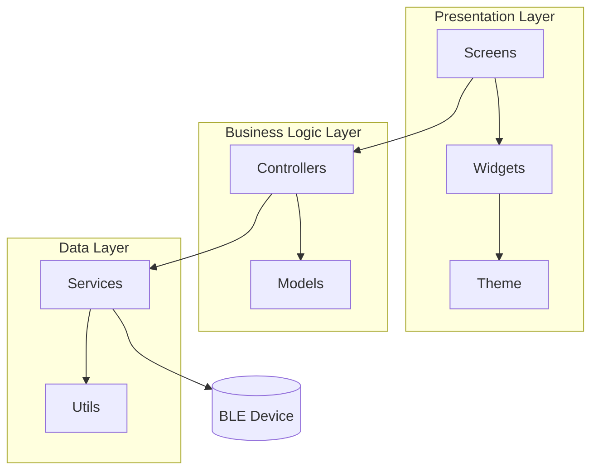
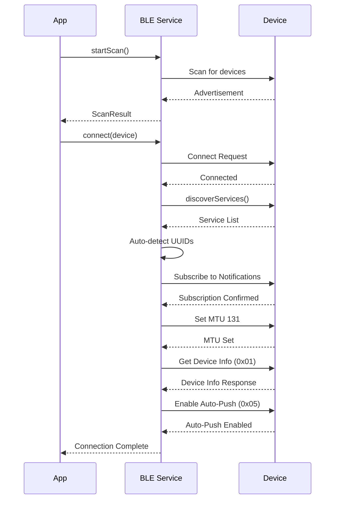
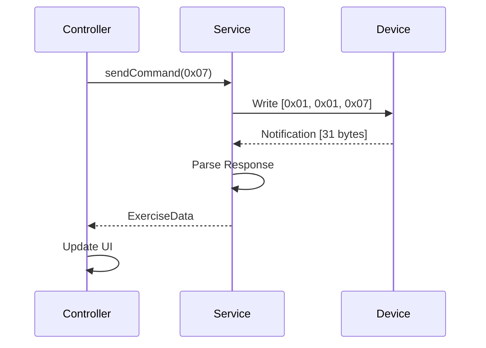
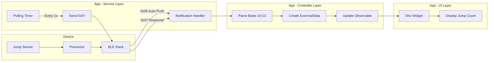
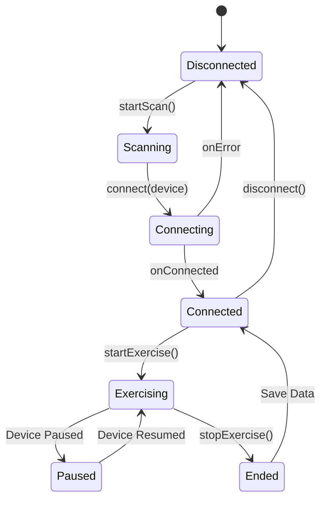
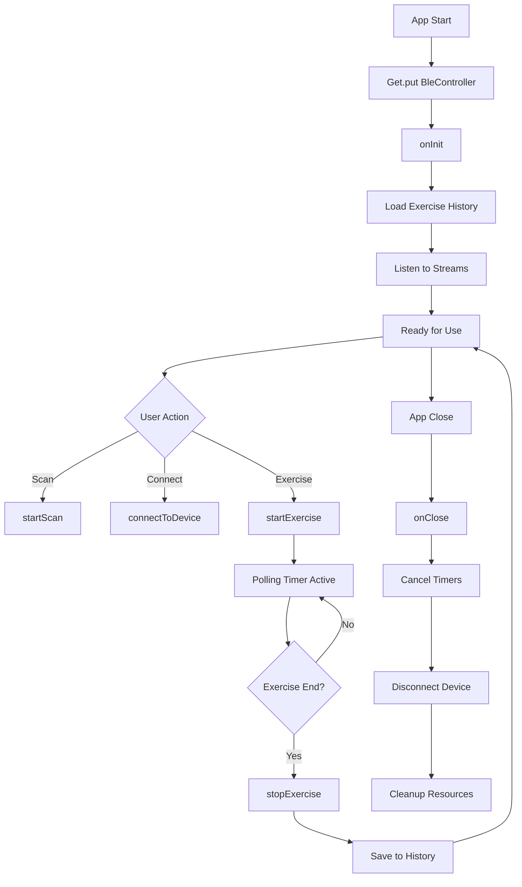
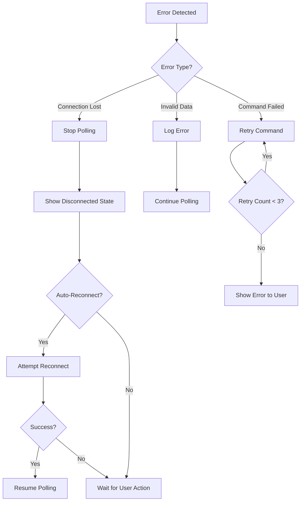

# Jumpeezzz Technical Documentation

## Table of Contents
1. [Architecture Overview](#architecture-overview)
2. [BLE Communication Protocol](#ble-communication-protocol)
3. [Data Flow Diagrams](#data-flow-diagrams)
4. [State Management](#state-management)
5. [Error Handling](#error-handling)
6. [Performance Optimization](#performance-optimization)

## Architecture Overview

### Three-Layer Architecture



### Component Responsibilities

#### Presentation Layer
- **Screens**: Full-page views (Home, Scan, Device, Workout)
- **Widgets**: Reusable UI components (DeviceTile, GradientButton, StatCard)
- **Theme**: Centralized styling and colors

#### Business Logic Layer
- **Controllers**: GetX controllers managing state and business logic
- **Models**: Data structures (DeviceInfo, ExerciseData, ExerciseMode)

#### Data Layer
- **Services**: BLE communication, data persistence
- **Utils**: Helper functions (byte conversion, formatting)

## BLE Communication Protocol

### Connection Lifecycle



### Command-Response Pattern



### Auto-Detection Algorithm

```dart
// Service Detection
1. Search for standard YXTS service (1910)
2. If not found, find service with both:
   - Write characteristic (write or writeWithoutResponse)
   - Notify characteristic (notify or indicate)
3. Use first compatible service

// Characteristic Detection
1. Search for standard UUIDs (2b11, 2b10)
2. If not found, auto-detect by properties:
   - Write: has write or writeWithoutResponse property
   - Notify: has notify or indicate property
3. Use first matching characteristics
```

## Data Flow Diagrams

### Exercise Data Flow



### State Transitions



## State Management

### GetX Reactive Pattern

```dart
// Observable State
final Rx<BluetoothConnectionState> connectionState = 
    Rx<BluetoothConnectionState>(BluetoothConnectionState.disconnected);

final Rx<ExerciseData?> currentExerciseData = Rx<ExerciseData?>(null);

// Reactive UI
Obx(() => Text('${currentExerciseData.value?.jumpCount ?? 0}'))

// State Updates
currentExerciseData.value = ExerciseData.fromBytes(data);
// UI automatically rebuilds
```

### Controller Lifecycle



## Error Handling

### Connection Error Handling

```dart
// Retry Strategy for Android Error 133
int retryCount = 0;
const maxRetries = 3;

while (retryCount < maxRetries) {
  try {
    await device.connect();
    return; // Success
  } catch (e) {
    if (e.toString().contains('133')) {
      retryCount++;
      if (retryCount < maxRetries) {
        await Future.delayed(Duration(milliseconds: 1000 * retryCount));
        continue; // Retry
      }
      throw Exception('Please unpair device in Bluetooth settings');
    }
    rethrow;
  }
}
```

### Data Validation

```dart
// Validate Exercise Data Length
if (data.length < 31) {
  print('⚠️ Invalid exercise data length: ${data.length}');
  return null;
}

// Validate Command Byte
final command = data[2];
if (command != 0x06 && command != 0x07) {
  print('⚠️ Unknown command: 0x${command.toRadixString(16)}');
  return null;
}

// Validate Jump Count Range
final jumpCount = ByteUtils.bytesToInt(data.sublist(10, 14));
if (jumpCount < 0 || jumpCount > 1000000) {
  print('⚠️ Invalid jump count: $jumpCount');
  return null;
}
```

### Error Recovery Flow



## Performance Optimization

### Memory Management

```dart
// Stream Subscription Cleanup
@override
void onClose() {
  _scanSubscription?.cancel();
  _connectionSubscription?.cancel();
  _notificationSubscription?.cancel();
  _exerciseDataTimer?.cancel();
  super.onClose();
}

// Characteristic Subscription Cleanup
void _cleanup() {
  for (var subscription in _characteristicSubscriptions) {
    subscription.cancel();
  }
  _characteristicSubscriptions.clear();
  _connectedDevice = null;
}
```

### Efficient Data Parsing

```dart
// Big-endian conversion optimized for 4-byte integers
static int bytesToInt(List<int> bytes) {
  int value = 0;
  for (int i = 0; i < bytes.length; i++) {
    value += (bytes[i] & 0xFF) << ((bytes.length - 1 - i) * 8);
  }
  return value;
}

// Avoid creating intermediate lists
final jumpCount = ByteUtils.bytesToInt(data.sublist(10, 14));
// Instead of: final bytes = data.sublist(10, 14); final count = convert(bytes);
```

### Polling Strategy

```dart
// Adaptive polling based on connection state
Timer.periodic(Duration(seconds: 1), (timer) {
  if (isConnected) {
    _bleService.getExerciseData().catchError((e) {
      // Don't stop timer on error - device might reconnect
      print('⚠️ Error requesting exercise data: $e');
    });
  } else {
    // Skip polling but keep timer running
    print('⚠️ Not connected - will retry when reconnected');
  }
});
```

### UI Optimization

```dart
// Use Obx for granular reactivity
Obx(() => Text('${currentExerciseData.value?.jumpCount ?? 0}'))
// Only this widget rebuilds when jump count changes

// Avoid rebuilding entire screen
// ❌ Bad: Obx(() => Scaffold(...))
// ✅ Good: Scaffold(body: Obx(() => Text(...)))
```

### BLE Optimization

```dart
// Set optimal MTU for data transfer
await device.requestMtu(131);

// Use writeWithoutResponse for commands (faster)
await characteristic.write(command, withoutResponse: true);

// Subscribe to all notify characteristics
// Ensures we receive data from any source
for (var char in notifyCharacteristics) {
  await char.setNotifyValue(true);
}
```

## Testing Recommendations

### Unit Tests

```dart
// Test byte conversion
test('bytesToInt converts big-endian correctly', () {
  final bytes = [0x00, 0x00, 0x00, 0x0A]; // 10 in big-endian
  expect(ByteUtils.bytesToInt(bytes), 10);
});

// Test data parsing
test('ExerciseData.fromBytes parses correctly', () {
  final data = [/* 31 bytes */];
  final exerciseData = ExerciseData.fromBytes(data);
  expect(exerciseData.jumpCount, 10);
});
```

### Integration Tests

```dart
// Test BLE connection flow
testWidgets('connects to device and displays info', (tester) async {
  await tester.pumpWidget(MyApp());
  await tester.tap(find.text('Find Jump Rope'));
  await tester.pumpAndSettle();
  // Mock device appears
  await tester.tap(find.text('YS838'));
  await tester.pumpAndSettle();
  expect(find.text('Device Information'), findsOneWidget);
});
```

### Manual Testing Checklist

- [ ] Scan finds all supported devices
- [ ] Connection succeeds on first attempt
- [ ] Connection recovers from Error 133
- [ ] Device info displays correctly
- [ ] Exercise mode selection works
- [ ] Jump count updates in real-time
- [ ] Exercise data saves to history
- [ ] Disconnection handled gracefully
- [ ] App survives hot restart
- [ ] Memory doesn't leak during long sessions

## Deployment

### Build Commands

```bash
# Android APK
flutter build apk --release

# Android App Bundle
flutter build appbundle --release

# iOS
flutter build ios --release
```

### Version Management

Update `pubspec.yaml`:
```yaml
version: 1.0.0+1  # version+buildNumber
```

### Release Checklist

- [ ] Update version number
- [ ] Test on physical devices
- [ ] Verify BLE permissions
- [ ] Check battery usage
- [ ] Test with all supported devices
- [ ] Update documentation
- [ ] Create release notes
- [ ] Build release artifacts
- [ ] Submit to app stores

---

**Last Updated:** 2025-12-11  
**Version:** 1.0.0
